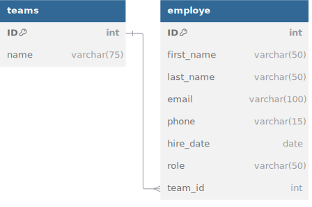

# Team Management Application

The application allows for creating, viewing, editing, and deleting user data. It provides the ability to add fields such as first name, last name, email, and access level. Features include pagination and sorting of the user list.

---

## Overview

### 🎯 Application Functionality:
- [ ] Displaying the list of employees (e.g., in a table or cards)
- [ ] Adding new employees
- [ ] Editing existing employees
- [ ] Viewing detailed information about employees
- [ ] Managing the project team
- [ ] Logging into the system (JWT)

### 🛠️ Tech stack:
- Front-end:  
- Styles:  
- Backend: 
- Database: 
  
### 💾 Database:
Get script from [/utils/database-run-script.sql](/utils/database-run-script.sql)

## Getting started
